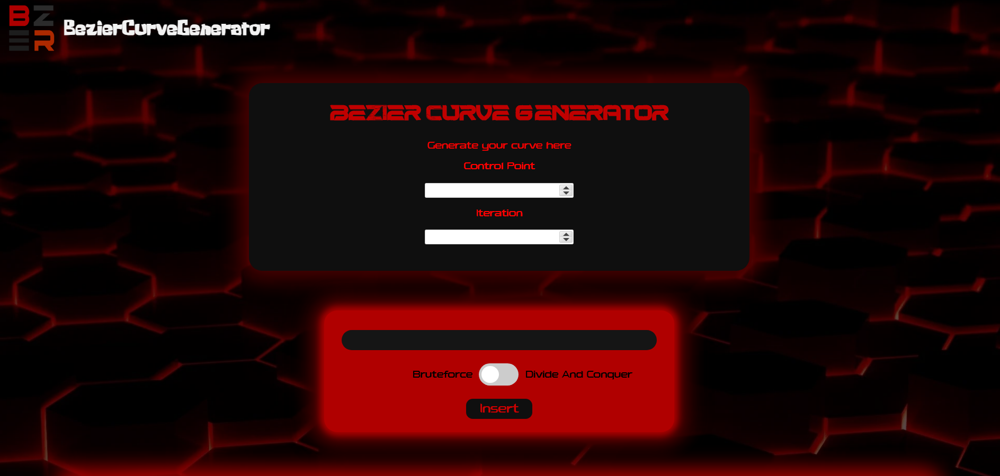
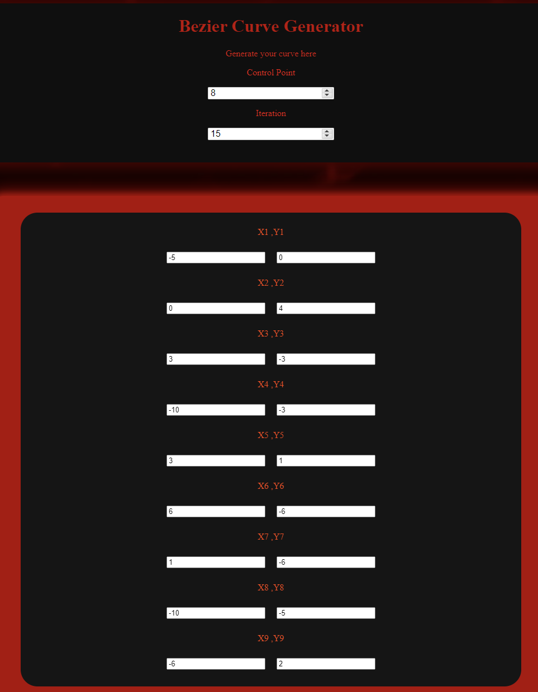

# Tugas Kecil 2 IF2211 Strategi Algoritma: Membangun Kurva Bézier dengan Algoritma Titik Tengah berbasis Divide and Conquer

## **Daftar Isi**

- [Deskripsi Program](#deskripsi-program)
- [Requirement Program](#requirements-program)
- [Set Up dan Build Program](#set-up-dan-build-program)
- [Home Page](#home-page)
- [Test](#test)
- [Author](#author)

## **Deskripsi Program**

<p align="justify">
Kurva Bézier adalah kurva halus yang sering digunakan dalam desain grafis, animasi, dan manufaktur. Kurva ini dibuat dengan menghubungkan beberapa titik kontrol, yang menentukan bentuk dan arah kurva. Cara membuatnya cukup mudah, yaitu dengan menentukan titik-titik kontrol dan menghubungkannya dengan kurva. Kurva Bézier memiliki banyak kegunaan dalam kehidupan nyata, seperti pen tool, animasi yang halus dan realistis, membuat desain produk yang kompleks dan presisi, dan membuat font yang indah dan unik. Keuntungan menggunakan kurva Bézier adalah kurva ini mudah diubah dan dimanipulasi, sehingga dapat menghasilkan desain yang presisi dan sesuai dengan kebutuhan.

Repository ini berisi implementasi dalam membangun kurva Bézier dengan algoritma titik tengah berbasis divide and conquer. Sebagai pembanding, akan digunakan juga algoritma brute force dalam mencari titik-titik yang membangun kurva Bézier.

</p>

## **Requirements Program**
Program ini membutuhkan dua modul yaitu react-numeric-input & mafs. Install kedua modul ini di src (src utama bukan src react).
1. react-numeric-input:
     ```bash
     npm install react-numeric-input --save
     ```
2. mafs:
     ```bash
     npm install mafs --save
     ```

## **Set Up dan Build Program**
1. Download file .zip
2. Buka terminal dan pergi ke direktori dari src 
     ```bash
     ./Tucil2_13522110_13522116/src
     ```
3. Untuk build program masukkan perintah:
     ```bash
     npm run build
     ``` 
     Cukup lakukan sekali saja
4. Untuk menjalankan program masukkan perintah 
     ```bash
     npm run start
     ```
5. Buka satu lagi jendela terminal ddengan direktori yang sama
6. Lalu masukkan perintah 
     ```bash
     go run .
     ```
7. Jika diminta untuk `allow access`, tekan tombol `Allow`
8. Program sudah siap untuk digunakan

## **Home Page**
<p align="center">

</p>

## **Test**
<p align="center">

Input:


Output algoritma brute force:


Output algoritma divide and conquer:


</p>

## **Author**

|   NIM    |           Nama           |
| :------: | :----------------------: |
| 13522110 | Marvin Scifo Y. Hutahaean  |
| 13522116 |       Naufal Adnan       |

<h4 align="center">
  Created by @13522110_13522116<br/>
  2024
</h4>
<hr>
